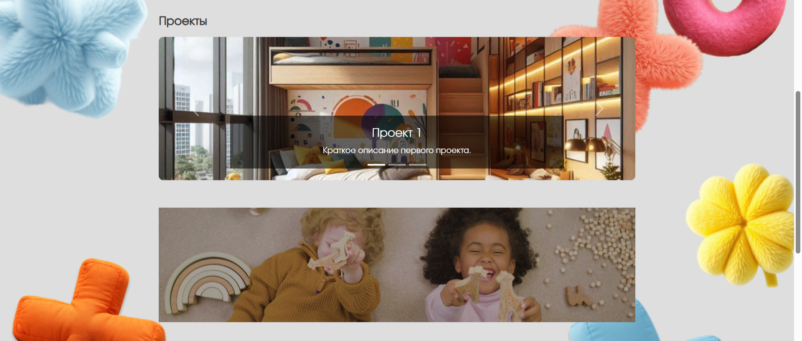
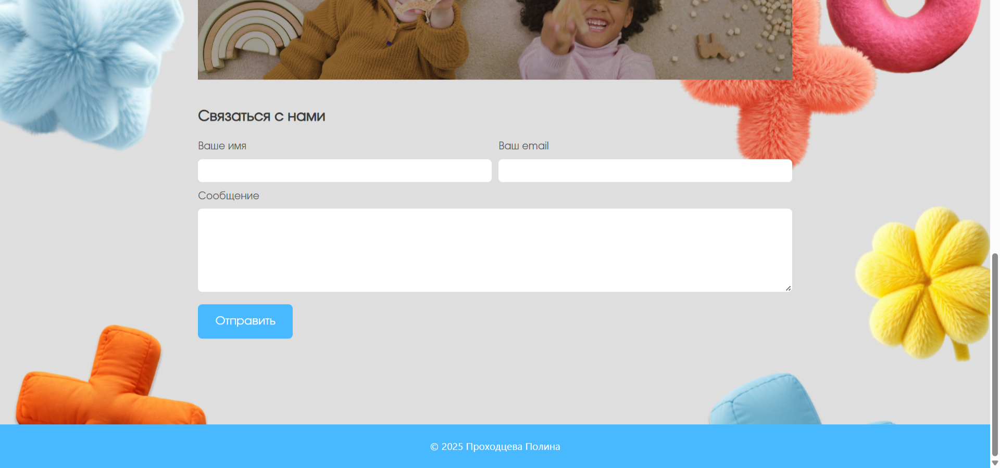

# 🌟 Сайт детской мебели

Автор: Полина Проходцева

Простой, адаптивной и современный сайт, созданный с использованием **HTML, CSS и небольшого количества JavaScript**.  

---

## 🚀 Основные возможности

- ✅ Адаптивный дизайн (работает на мобильных, планшетах и десктопах)  
- ✅ Карусель проектов на Bootstrap  
- ✅ Форма обратной связи в два столбца  
- ✅ Видео-баннер на всю ширину  
- ✅ Кастомные шрифты  
- ✅ Прозрачный градиент в шапке  
- ✅ Чистый и читаемый код

---

## 🛠️ Технологии

- **HTML5**
- **CSS3** (Flexbox, Grid, `@font-face`, градиенты)
- **JavaScript** (для карусели и формы — опционально)
- **Bootstrap 5** (только для карусели)
- **Formspree** (для отправки писем без бэкенда)

Ссылка на GitHub: https://github.com/Polyapolyapolya/SiteKidsFurniture.git